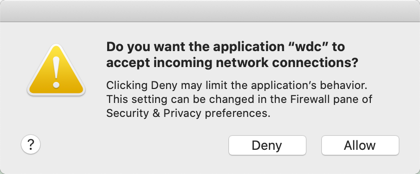

# Peloton Tableau Connector
This is a [Tableau Web Data Connector](https://tableau.github.io/webdataconnector/#) for visualizing your personal Peloton cycling data inside of Tableau.

> DISCLAIMER
> If you've come here looking for good, clean, idiomatic Go code, this is _not_ the repo you are looking for.  Move along ...

# Status
It's early days for this connector, but I hope, given good feedback, it will progress quickly.  This also means you may encounter bugs, or breaking schema changes.

## Availability
Currently (as of Jan 18, 2021), this is publicly available online in an alpha release, but may be unstable.  You can visit the home page [here](https://www.mypelotondata.com).

After receiving feedback and doing a little more testing, my intent is submit this as a [Community Connector](https://tableau.github.io/webdataconnector/community/). 

If you'd like to try the online connector (rather than running it locally), you can head over to [Connect with Tableau Desktop](#connect-with-tableau-desktop), and use the public URL provided.  Or, you can use this locally if you're willing to install and run a lightweight Go executable.  See [Usage](#usage) if you'd like to try it out, and provide feedback.

## Tables
This initial version is aimed only at cycling classes.  I built the schema such that I could analyze my personal record ("PR") trends.  For example, do I PR during certain times of day, or days of the week, or with certain instructors?

Therefore, there's only one table right now, called `Workouts`.  It provides one row for each completed cycling workout.  The raw schema is as follows.

|Field Alias|Data Type|Description|
|--- |--- |--- |
|Extract Time UTC|Datetime|The time in UTC that the data were extracted from Peloton.|
|Start Time|Datetime|The local time you started the class.|
|Time Zone|String|The time zone you were in when you took the class.|
|Start Time UTC|Datetime|The time in UTC you started the class.|
|Was PR|Boolean|Indicates whether or not you achieved a personal record in this workout for the ride length.|
|Current PR|Boolean|Indicates whether or not this workout is your current personal record for the ride length|
|Type|String|The type of ride such as Beginner, Climb, Live DJ, Intervals, Music, etc.|
|Ride Title|String|The descriptive title of the ride.|
|Instructor|String|The name of the ride instructor.|
|Ride Length Minutes|Integer|The length in minutes the ride was scheduled for.|
|Output|Integer|The total output in kj.|
|Avg Watts|Integer|The average output in watts.|
|Avg Resistence|Float|The average resistance as a percentage.|
|Avg Cadence RPM|Integer|The average cadence in rpm.|
|Avg Speed MPH|Float|The average speed in mph.  This will be 0 if your Peloton display preferences are Kilometers.|
|Avg Speed KPH|Float|The average speed in kph.  This will be 0 if your Peloton display preferences are Miles.|
|Distance Miles|Float|The total distance traveled in miles.  This will be 0 if your Peloton display preferences are Kilometers.|
|Distance Kilometers|Float|The total distance traveled in kilometers.  This will be 0 if your Peloton display preferences are Miles.|
|Calories Burned|Integer|The total calories burned in kcal.|
|Avg Heart Rate|Float|The average heart rate in bpm.|

As feedback rolls in, more fields and tables may be added.

# Usage
At this time, the only way to run this locally is to build and run the lightweight Go executable.  No storage is used, and this is completely stateless, meaning it can be shut down and started up at any time.

> The instructions here are for Mac, tested using `go1.15.2` and `Tableau Desktop 2020.3`.

## Install Go
If you do not have Go, or have a version older than `go1.11`, get it or update it.  As usual with Mac, the smoothest way is using [Homebrew](https://formulae.brew.sh/formula/go).  However, you can also install from the official [Go website](https://golang.org/doc/install).

```shell script
brew install go
```

## Build and Run the Connector
```shell script
git clone https://github.com/weissleb/peloton-tableau-connector.git && cd peloton-tableau-connector
```

> This is a one-time task, unless you want to pull any updates using `git pull` from inside the repo's directory.

Build the executable.

```shell script
go build -o wdc github.com/weissleb/peloton-tableau-connector
```

> This is a one-time task, unless you'll pulled any updates from the repo using `git pull`, and would like to build the connector with those changes.

Set the port (e.g. 8889) and start the connector.

```shell script
>_ export PORT=8889 && ./wdc

    ____       __      __            
   / __ \___  / /___  / /_____  ____
  / /_/ / _ \/ / __ \/ __/ __ \/ __ \
 / ____/  __/ / /_/ / /_/ /_/ / / / /
/_/    \___/_/\____/\__/\____/_/ /_/ 

connector is on port 8889
2021/01/14 21:50:32 authentication is on
2021/01/14 21:50:32 caching of workouts is off
```

_If necessary, allow connections._



## Connect with Tableau Desktop
Install [Tableau Desktop](https://public.tableau.com/en-us/s/download), if you haven't already.

Open Tableau, and use the Web Data Connector option.  If you're running this locally, enter `http://localhost:<port>/wdc` (e.g `http://localhost:8889/wdc`).  If you're connecting to the online version (currently in alpha, and likely unstable), enter `https://www.mypelotondata.com/wdc`.

Enter your Peloton credentials.

Extract your data by clicking Get Cycling Data link.

Build useful and beautiful reports and dashboards.  This one can be found on [Tableau Public here](https://public.tableau.com/profile/brian.weissler#!/vizhome/PelotonPRs/PRsoverTime).

## Shutdown
As noted above, the connector is stateless.  Once you're done, and you've saved your Tableau workbook, feel free to shut it down.  A simple `ctrl+c` in the terminal will do the trick.

## Restart
When you want to pull new data from Peloton into your Tableau workbook, simply open a terminal window and start the connector (_assuming the repo was cloned into `$HOME` and built as shown above_).

```shell script
>_ export PORT=8889 && $HOME/peloton-tableau-connector/wdc 

    ____       __      __            
   / __ \___  / /___  / /_____  ____
  / /_/ / _ \/ / __ \/ __/ __ \/ __ \
 / ____/  __/ / /_/ / /_/ /_/ / / / /
/_/    \___/_/\____/\__/\____/_/ /_/ 

connector is on port 8889
2021/01/14 21:50:32 authentication is on
2021/01/14 21:50:32 caching of workouts is off
```