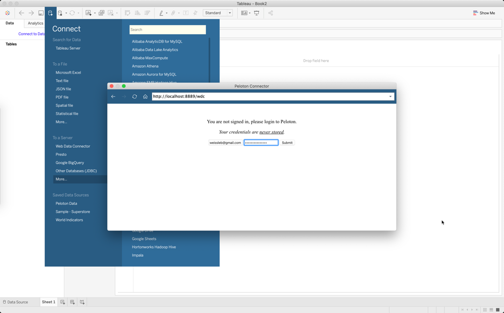

# Peloton Tableau Connector
This is a [Tableau Web Data Connector](https://tableau.github.io/webdataconnector/#) for visualizing your personal Peloton cycling data inside of Tableau.

# Status
It's early days for this connector, but I hope, given good feedback, it will progress quickly.

## Availability
Currently (as of Jan 10, 2021), this is not available online anywhere, but can be used locally, if you're willing to install and run a couple of lightweight Go executables.  My intent is expose this publicly and submit it as a [Community Connector](https://tableau.github.io/webdataconnector/community/).

For now, see [Usage](#usage) if you'd like to try it out, and provide feedback.

## Tables
This initial version is aimed only at cycling classes.  I built the schema such that I could analyze my personal record ("PR") trends.  For example, do I PR during certain times of day, or days of the week, or will certain instructors?

Therefore, there's only one table right now, called `workouts`.  It provides one row for each completed cycling workout.  The raw schema is as follows.

```json
{
  "name": "workouts",
  "columns": [
    {
      "name": "ExtractTimeUTC",
      "goType": "time.Time"
    },
    {
      "name": "Id",
      "goType": "string"
    },
    {
      "name": "StartTimeSeconds",
      "goType": "uint64"
    },
    {
      "name": "TimeZone",
      "goType": "string"
    },
    {
      "name": "StartTimeUTC",
      "goType": "time.Time"
    },
    {
      "name": "StartTime",
      "goType": "time.Time"
    },
    {
      "name": "Output",
      "goType": "float32"
    },
    {
      "name": "WasPR",
      "goType": "bool"
    },
    {
      "name": "CurrentPR",
      "goType": "bool"
    },
    {
      "name": "Type",
      "goType": "string"
    },
    {
      "name": "Status",
      "goType": "string"
    },
    {
      "name": "RideId",
      "goType": "string"
    },
    {
      "name": "RideTitle",
      "goType": "string"
    },
    {
      "name": "RideDifficulty",
      "goType": "float32"
    },
    {
      "name": "RideLevel",
      "goType": "string"
    },
    {
      "name": "Instructor",
      "goType": "string"
    },
    {
      "name": "InstructorImageURL",
      "goType": "string"
    },
    {
      "name": "DurationSeconds",
      "goType": "uint16"
    },
    {
      "name": "HasWeights",
      "goType": "bool"
    }
  ]
}
```

As feedback rolls in, more tables will be added.

# Usage
At this time, the only way to run this is to build and run the lightweight Go executables for the REST server (_post an issue here if you'd like access to the REST server_), and this connector.  Pretty much no storage is used, and both components are completely stateless, meaning they can be shut down and started up at any time.

> The instructions here are for Mac, tested using `go1.15.2` and `Tableau Desktop 2020.3`.

## Install Go
If you do not have Go, or have a version older than `go1.11`, get it or update it.  As usual with Mac, the smoothest way is using [Homebrew](https://formulae.brew.sh/formula/go).  However, you can also install from the official [Go website](https://golang.org/doc/install).

```shell script
brew install go
```
 
## Run the REST Server
The REST server is not publicly available in Github at this time.  However, I will add collaborators who want to clone the repo and run the REST server locally.  This will provide the API that is called by this connector app.  

Please submit an issue on this repo asking for access to the REST server if you're interested.  Once granted access, you can use the `README` there to build and run the REST server.  Ultimately, once built, you should be able to run the following (_assuming you cloned the repo to `$HOME`_).

```shell script
>_ $HOME/peloton-data-extractor/servicehandlers

    ____       __      __            
   / __ \___  / /___  / /_____  ____
  / /_/ / _ \/ / __ \/ __/ __ \/ __ \
 / ____/  __/ / /_/ / /_/ /_/ / / / /
/_/    \___/_/\____/\__/\____/_/ /_/ 

servicehandlers is at http://localhost:30000
```

## Build and Run the Connector
Open another terminal and clone this repo.

```shell script
git clone https://github.com/weissleb/peloton-tableau-connector.git && cd peloton-tableau-connector
```

> This is a one-time task, unless you want to pull any updates using `git pull` from inside the repo's directory.

Build the executable.

```shell script
go build -o wdc github.com/weissleb/peloton-tableau-connector
```

> This is a one-time task, unless you'll pulled any updates from the repo using `git pull`, and would like to build the connector with those changes.

Start the connector (you can change the Port if you'd like at `config/config.go`).

```shell script
>_ ./wdc 

    ____       __      __            
   / __ \___  / /___  / /_____  ____
  / /_/ / _ \/ / __ \/ __/ __ \/ __ \
 / ____/  __/ / /_/ / /_/ /_/ / / / /
/_/    \___/_/\____/\__/\____/_/ /_/ 

connector is at http://localhost:8889
```

## Connect with Tableau Desktop
Install [Tableau Desktop](https://public.tableau.com/en-us/s/download), if you haven't already.

Open Tableau, and use the Web Data Connector option.  Enter the URL which was output to the screen on the previous step (e.g. http://localhost:8889).


Enter your Peloton credentials.



Extract your data.


Build useful and beautiful reports and dashboards.


## Shutdown
As noted above, the connector and REST server are stateless.  Once you're done, and you've saved your Tableau workbook, feel free to shut them both down.  A simple `ctrl+c` in each terminal will do the trick.

## Restart
If you ever want to pull new data from Peloton into your Tableau workbook, simply open two terminal windows and start both components (_assuming both repo's were cloned into `$HOME` and built as shown above_).

In first terminal ...
```shell script
>_ $HOME/peloton-data-extractor/servicehandlers

    ____       __      __            
   / __ \___  / /___  / /_____  ____
  / /_/ / _ \/ / __ \/ __/ __ \/ __ \
 / ____/  __/ / /_/ / /_/ /_/ / / / /
/_/    \___/_/\____/\__/\____/_/ /_/ 

servicehandlers is at http://localhost:30000
```

In second terminal ...
```shell script
>_ $HOME/peloton-tableau-connector/wdc 

    ____       __      __            
   / __ \___  / /___  / /_____  ____
  / /_/ / _ \/ / __ \/ __/ __ \/ __ \
 / ____/  __/ / /_/ / /_/ /_/ / / / /
/_/    \___/_/\____/\__/\____/_/ /_/ 

connector is at http://localhost:8889
```